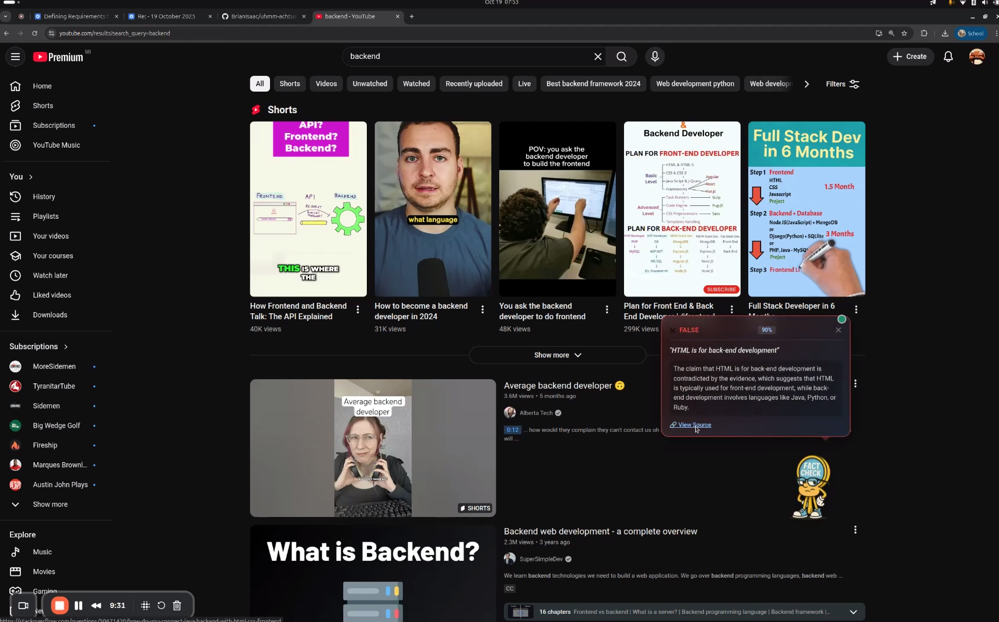

# Uhmm Achtually - Real-time AI Fact Checker

A real-time fact-checking system that monitors conversations in video meetings and YouTube, extracts factual claims, and verifies them using AI and web search. Features an animated mascot that alerts you when questionable claims are detected.

**Technical Challenge:** Balancing sub-second latency requirements with the reasoning depth needed for accurate fact verification in live conversations.

## Features

- **Real-time Audio Monitoring**: Captures system audio from Zoom, Google Meet, Teams, and YouTube
- **Automatic Claim Extraction**: Uses AI to identify factual claims in conversations
- **Web-based Verification**: Searches trusted sources to verify claims
- **Confidence Scoring**: Provides confidence levels for each verdict
- **Chrome Extension**: Animated mascot with speech bubbles for visual fact-check alerts
- **Optimised Pipeline**: 1.5-2.5s end-to-end latency whilst maintaining reasoning quality

## Architecture

```
System Audio → WebSocket Server (FastAPI) → STT (Groq) → Claim Extraction (PydanticAI)
                       ↓                            ↓
                Chrome Extension ← WebSocket ← Web Search (Exa) → Verification (Groq)
                       ↓
                 Mascot UI (alerts on false/unclear claims)
```

### Core Components

1. **Audio Capture**: System audio monitoring using sounddevice for real-time capture
2. **WebSocket Server**: FastAPI server with clean architecture and dependency injection
3. **Speech-to-Text**: Groq STT with Whisper model
4. **Claim Extraction**: PydanticAI agent to identify factual claims
5. **Web Search**: Exa API for fast neural/keyword search
6. **Verification**: PydanticAI agent to analyse evidence and generate verdicts
7. **Chrome Extension**: Animated mascot UI with speech bubbles for visual alerts

### Architecture Principles

The WebSocket server follows clean architecture principles:
- **Separation of Concerns**: Each module has a single responsibility
- **Dependency Injection**: Services are injected, not hardcoded
- **Layered Architecture**: Clear separation between API, Core, and Infrastructure layers
- **Message Factory Pattern**: Consistent message creation across the application

## Project Structure

```
uhmm-achtually/
├── backend/                            # Python backend server
│   ├── main.py                         # Main entry point for WebSocket server
│   ├── src/
│   │   ├── api/                        # API layer (WebSocket + HTTP)
│   │   ├── core/                       # Business logic (fact-checking, NLP, transcription)
│   │   ├── domain/                     # Domain models and interfaces
│   │   ├── infrastructure/             # External clients (Groq, Exa)
│   │   └── processors/                 # Audio processing and claim extraction
│   ├── pyproject.toml                  # Python dependencies (uv)
│   └── .env                            # Environment variables (API keys)
│
├── chrome-extension/                   # Chrome extension for visual alerts
│   ├── manifest.json                   # Extension configuration
│   ├── background/
│   │   └── background.js               # WebSocket client & service worker
│   ├── content/
│   │   ├── content.js                  # Mascot UI logic
│   │   └── content.css                 # Mascot styling & animations
│   ├── popup/
│   │   ├── popup.html                  # Extension popup UI
│   │   ├── popup.js                    # Popup logic & settings
│   │   └── popup.css                   # Popup styling
│   ├── assets/
│   │   ├── thinking-pose.png           # Mascot default state
│   │   └── talking-pose.png            # Mascot alert state
│   └── icons/                          # Extension icons
│
└── README.md
```

## Setup

### Prerequisites

- **Python 3.12+**
- **Google Chrome** browser
- **API Keys:**
  - [Groq API key](https://console.groq.com/) for STT and LLM (required)
  - [Exa API key](https://exa.ai/) for web search (required)

### Installation

1. Clone the repository:
```bash
git clone https://github.com/yourusername/uhmm-achtually.git
cd uhmm-achtually
```

2. Install UV package manager (if not already installed):
```bash
curl -LsSf https://astral.sh/uv/install.sh | sh
```

3. Navigate to backend and install dependencies:
```bash
cd backend
uv sync --all-groups
```

4. Configure environment variables:

   Create a `.env` file in the `backend` directory with your API keys:
   ```env
   # Required
   GROQ_API_KEY=your_groq_api_key_here
   EXA_API_KEY=your_exa_api_key_here

   # Optional - Customise trusted search domains
   ALLOWED_DOMAINS=stackoverflow.com,github.com,python.org,reactjs.org
   ```

5. Start the backend server:
   ```bash
   uv run python main.py
   ```

   The server will start on `ws://localhost:8765` and begin capturing system audio.

## Chrome Extension Setup

### Installation

1. **Open Chrome Extensions page:**
   - Navigate to `chrome://extensions/` in your Chrome browser
   - Enable **Developer mode** (toggle in top-right corner)

2. **Load the extension:**
   - Click **"Load unpacked"**
   - Select the `chrome-extension` folder from this repository

3. **Verify installation:**
   - You should see "Uhmm Actually - AI Fact Checker" in your extensions list
   - The extension icon should appear in your Chrome toolbar

4. **Check connection status:**
   - Click the extension icon to open the popup
   - Verify it shows "Connected" (green indicator)
   - If disconnected, make sure the backend server is running

### Using the Mascot

Once both the backend server and Chrome extension are running:

1. **Navigate to a supported platform:**
   - **Zoom** (zoom.us)
   - **Google Meet** (meet.google.com)
   - **Microsoft Teams** (teams.microsoft.com)
   - **YouTube** (youtube.com)

2. **The mascot will appear:**
   - An animated character appears in the bottom-right corner
   - Green dot indicates active WebSocket connection
   - You can drag and drop the mascot to reposition it

3. **When false or unclear claims are detected:**
   - The mascot switches to "talking" pose
   - A speech bubble appears with the verdict
   - Shows confidence percentage, rationale, and evidence link
   - Bubble auto-hides after 10 seconds

4. **Verdict types:**
   - **Contradicted** (red bubble): Claim is false or contradicted by evidence
   - **Unclear** (yellow bubble): Insufficient evidence to verify
   - **Supported**: No alert shown (claim is true)
   - **Not Found**: No claims detected in the conversation

### Mascot Features

- **Drag & Drop**: Click and drag to reposition the mascot anywhere on the page
- **Persistent Position**: Your chosen position is saved in browser storage
- **Floating Animation**: Gentle bobbing motion when idle
- **Connection Status**: Green dot when connected, yellow when disconnected
- **Responsive Design**: Adapts to different screen sizes

## Usage Examples

### Demo: Fact-Checking in Action

<p align="center">
  
</p>

The screenshot shows the extension fact-checking a YouTube video claiming **"HTML is for back-end development"**. The mascot appears in the bottom-right with a red speech bubble indicating the claim is **contradicted** with 90% confidence, along with a rationale and evidence link.

### Backend Console Output

When the backend is running, you'll see real-time processing in the terminal:

```
INFO:     Started server process
INFO:     Uvicorn running on http://localhost:8765
INFO:     WebSocket connection established
INFO:     Transcribing: "HTML is for back-end development"
INFO:     Extracting claims from transcript
INFO:     Found 1 claim: HTML is for back-end development
INFO:     Searching for evidence...
INFO:     Verdict: contradicted (90% confidence)
INFO:     Sent verdict to Chrome extension
```

### Chrome Extension Experience

When someone makes a false claim in a video:

1. **Audio captured**: System picks up the conversation
2. **Claim detected**: AI identifies a factual claim
3. **Evidence gathered**: Searches trusted sources
4. **Verdict delivered**:
   - Mascot animates to "talking" pose
   - Speech bubble appears with verdict
   - Red bubble: "This claim is contradicted by evidence"
   - Shows 90% confidence with link to source

## Configuration

### Configuration File

Edit `backend/dev_config.yaml` to customise system behaviour:

```yaml
# Voice Activity Detection (optimised for low latency)
vad:
  disable: false         # Set true to bypass VAD
  start_secs: 0.1       # Faster speech detection
  stop_secs: 0.8        # Natural pause tolerance
  min_volume: 0.5       # Sensitivity threshold (0.0-1.0)

# Speech-to-Text Provider
stt:
  provider: "groq"      # Options: "groq" or "avalon"
  groq:
    model: "whisper-large-v3"
    language: "en"

# LLM Models (Groq)
llm:
  claim_extraction_model: "llama-3.3-70b-versatile"
  verification_model: "llama-3.3-70b-versatile"
  temperature: 0.1      # Lower = more deterministic (0.0-1.0)

# Logging
logging:
  level: "INFO"         # DEBUG, INFO, WARNING, ERROR
  log_transcriptions: true
```

### STT Provider Selection

The system supports two STT providers:

1. **Groq STT** (default) - Fast, reliable Whisper-based transcription
2. **Avalon STT** - AquaVoice, 97.3% accuracy on technical terms

To switch providers, edit `backend/dev_config.yaml`:
```yaml
stt:
  provider: "groq"  # Switch from "groq" to "avalon"
```

### Allowed Domains

The fact-checker searches only trusted domains specified in ALLOWED_DOMAINS. This constraint serves two purposes:
1. **Speed**: Reduces search space for faster results (<500ms)
2. **Reliability**: Ensures evidence comes from authoritative sources

Default domains include:
- docs.python.org (Python documentation)
- kubernetes.io (Kubernetes docs)
- owasp.org (Security best practices)
- nist.gov (Standards and guidelines)
- postgresql.org (PostgreSQL documentation)

Add your own trusted sources by updating `backend/.env`.

## Troubleshooting

### Backend Issues

**Server won't start:**
- Ensure you're in the `backend` directory
- Check Python version: `python --version` (must be 3.12+)
- Verify dependencies: `uv sync --all-groups`
- Check port 8765 isn't already in use: `lsof -i :8765`

**API errors:**
- Verify API keys in `.env` file
- Check API key validity at [Groq Console](https://console.groq.com/) and [Exa Dashboard](https://exa.ai/)
- Ensure no extra spaces or quotes around API keys

**No audio being captured:**
- Check system audio permissions for the terminal/Python
- Verify sounddevice is properly installed: `uv run python -c "import sounddevice; print(sounddevice.query_devices())"`
- On macOS: Grant microphone access in System Preferences → Security & Privacy

### Chrome Extension Issues

**Extension not connecting:**
- Ensure backend server is running on `ws://localhost:8765`
- Check browser console for WebSocket errors (F12 → Console)
- Click extension icon and try "Reconnect" button

**Mascot not appearing:**
- Verify you're on a supported platform (Zoom, Meet, Teams, YouTube)
- Check extension is enabled at `chrome://extensions/`
- Reload the page after starting the backend

**No verdicts showing:**
- Check backend console for claim detection logs
- Verify ALLOWED_DOMAINS includes relevant sources
- Speech must contain clear factual claims to trigger detection

## Development

### Running Tests

```bash
cd backend
uv run pytest tests/
```

### Adding New Domains

Update the ALLOWED_DOMAINS environment variable in `backend/.env`:

```env
ALLOWED_DOMAINS=docs.python.org,stackoverflow.com,developer.mozilla.org
```

## Performance & Latency Optimisation

### The Latency-Reasoning Trade-off

Real-time fact-checking presents a fundamental challenge: **how quickly can we verify claims without sacrificing accuracy?** Conversations move fast, and users expect near-instant feedback, yet thorough fact-checking requires:

1. Understanding context and nuance in claims
2. Searching multiple sources for evidence
3. Reasoning about contradictions and reliability
4. Generating confident verdicts

### Our Approach

We optimise the pipeline at each stage to minimise latency whilst maintaining reasoning quality:

| Component | Latency | Optimisation Strategy |
|-----------|---------|----------------------|
| **Speech-to-Text** | 200-400ms | Groq's optimised Whisper Large v3 with streaming |
| **Claim Extraction** | 200-300ms | PydanticAI with Llama 3.3 70B (structured outputs, low temperature) |
| **Web Search** | <500ms | Exa keyword mode on pre-filtered trusted domains |
| **Verification** | 500-800ms | Focused prompts with evidence pre-filtering |
| **Total Pipeline** | **1.5-2.5s** | End-to-end fact-check delivered to user |

### Key Design Decisions

**Speed optimisations:**
- **Keyword search over neural search**: Exa's keyword mode is 3-5x faster whilst maintaining relevance on domain-filtered results
- **Sentence-level chunking**: Process claims as complete sentences arrive, don't wait for full paragraphs
- **Pre-filtered domains**: ALLOWED_DOMAINS constraint reduces search space and improves speed
- **Structured outputs**: PydanticAI enforces strict schemas, eliminating parsing overhead
- **Low temperature (0.1)**: Reduces model reasoning time whilst maintaining accuracy for factual tasks

**Reasoning quality:**
- **70B parameter model**: Llama 3.3 70B provides strong reasoning whilst being faster than 405B models
- **Two-stage AI pipeline**: Separate claim extraction and verification agents for specialised reasoning
- **Evidence-based verification**: LLM evaluates actual source content, not just search snippets
- **Confidence scoring**: Expresses uncertainty when evidence is insufficient

**Trade-offs we accept:**
- May miss subtle claims that require multi-sentence context (sentence-level processing)
- Limited to pre-approved domains (won't find evidence on new or niche sites)
- Favours precision over recall (alerts only on contradicted/unclear claims, not all claims)

## Architecture Details

### Processing Pipeline

1. **Audio Capture**: System audio monitoring using sounddevice library
2. **VAD**: Silero VAD detects speech segments
3. **STT**: Groq Whisper converts speech to text
4. **Sentence Buffering**: Accumulates text until sentence boundary detected
5. **Claim Extraction**: PydanticAI analyses sentence for factual claims
6. **Web Search**: Exa searches trusted domains for evidence
7. **Verification**: PydanticAI analyses evidence and generates verdict
8. **WebSocket Delivery**: Verdict sent to Chrome extension in real-time

### Why This Architecture?

**Clean separation of concerns:**
- API layer handles WebSocket/HTTP communication
- Core layer contains business logic (fact-checking, NLP)
- Infrastructure layer manages external API clients
- Domain layer defines interfaces and models

**Dependency injection:**
- Services are injected via constructors, making testing and swapping implementations easy
- Example: Switch from Groq STT to Avalon STT by changing config, no code changes needed

**Message factory pattern:**
- Consistent message formatting for WebSocket communication
- Simplifies debugging and ensures protocol compliance

## Contributing

1. Fork the repository
2. Create a feature branch (`git checkout -b feature/amazing-feature`)
3. Commit your changes (`git commit -m 'Add amazing feature'`)
4. Push to the branch (`git push origin feature/amazing-feature`)
5. Open a Pull Request

## License

This project is licensed under the MIT License - see the LICENSE file for details.

## Acknowledgements

- [PydanticAI](https://github.com/pydantic/pydantic-ai) for structured AI outputs
- [Exa](https://exa.ai) for fast neural search
- [Groq](https://groq.com) for LLM and STT services
- [FastAPI](https://fastapi.tiangolo.com/) for the WebSocket server framework
- [Pipecat](https://github.com/pipecat-ai/pipecat) for audio processing components
- [Avalon](https://avalon.ai) for alternative STT services

---

<br>
<p align="right">
  
</p>
