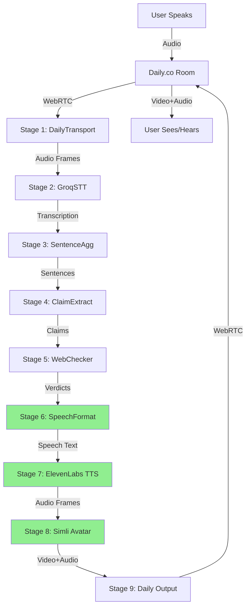

# Enhancement Specification: Virtual Human Bot with Text-to-Speech

**Status:** Enhancement Proposal
**Target Phase:** Phase 2 (Post-MVP)
**Dependencies:** Phase 1 MVP (Web Search Only)
**Estimated Implementation:** 16-24 hours (2-3 developers)

---

## Executive Summary

This document outlines the technical specification for enhancing the current fact-checker bot with two major capabilities:

1. **Text-to-Speech (TTS) Output**: Bot replies with spoken audio using ElevenLabs or alternative TTS services
2. **Virtual Human Representation**: Bot appears as a realistic avatar/digital human in the video call

These enhancements will transform the bot from an invisible assistant to a visible, speaking participant, creating a more engaging and human-like interaction experience.

---

## Current State Analysis

### Existing Architecture (Phase 1 MVP)

**Bot Presence:**
- Audio-only connection via Pipecat DailyTransport (receives participant speech)
- Messaging-only connection via Daily CallClient (sends verdicts as app messages)
- No video output
- No audio output (bot listens but doesn't speak)

**Communication Flow:**
```
User speaks → Bot transcribes → Extracts claims → Verifies → Sends text message
```

**Limitations:**
- Bot is invisible to participants (no video presence)
- Bot is silent (no spoken responses)
- Responses are text-only via app messages/chat
- No visual engagement or personality

---

## Enhancement 1: Text-to-Speech (TTS) Integration with ElevenLabs

### Overview

Enable the bot to speak fact-check verdicts aloud using ElevenLabs' industry-leading neural TTS, allowing participants to hear verdicts with natural, human-like voice quality.

### Why ElevenLabs (Exclusive Choice)

**Technical Advantages:**
- **Ultra-low latency:** 75ms with Flash v2.5, 100-200ms with Turbo v2.5
- **WebRTC native support:** Announced July 2025 with best-in-class echo cancellation
- **Pipecat integration:** Two service options (WebSocket and HTTP-based)
- **Multilingual:** 32+ languages with automatic detection
- **Production-ready:** Battle-tested across billions of voice calls
- **Enterprise-grade:** Partnerships with Salesforce and major platforms

**Voice Quality:**
- Most emotionally-aware speech synthesis (Multilingual v2)
- Professional Voice Clones (PVCs) from real voice artists
- Natural prosody, emotion, and contextual understanding
- 10,000+ community voices with descriptive tags
- Custom voice cloning from 1 minute of audio

**Pipecat Integration:**
- Native WebSocket-based service (ElevenLabsTTSService) with word timestamps
- HTTP-based service (ElevenLabsHttpTTSService) for simpler integration
- Active maintenance and wide adoption in 2025
- Supports streaming audio and voice customisation

### ElevenLabs Model Selection

#### Recommended: Turbo v2.5 (Best Balance)

**Eleven Turbo v2.5** - Optimal for fact-checker bot

**Specifications:**
- **Latency:** 100-200ms (3x faster than Multilingual v2)
- **Languages:** 32 including Hindi, French, Spanish, Mandarin, Vietnamese, Hungarian, Norwegian
- **Quality:** High-quality with good emotional range
- **Cost:** 0.5-1.0 credits per character (50% cheaper than before)
- **Use Case:** Real-time conversational AI requiring quality + speed balance

**Why Turbo v2.5 for Fact-Checking:**
- Fast enough for real-time (<200ms meets our <2s total target)
- High enough quality for professional credibility
- Good emotional control for different verdict types
- Most cost-effective for production use

#### Alternative: Flash v2.5 (Fastest)

**Eleven Flash v2.5** - If absolute minimum latency required

**Specifications:**
- **Latency:** ~75ms (fastest available)
- **Languages:** 32 languages
- **Quality:** Good quality, optimised for speed
- **Cost:** Lowest cost per character
- **Use Case:** Agents Platform and ultra-low latency scenarios

**Trade-off:** Slightly less emotional nuance than Turbo v2.5

#### Not Recommended: Multilingual v2

**Eleven Multilingual v2** - Highest quality but slower

**Specifications:**
- **Latency:** 300-600ms (too slow for real-time)
- **Quality:** Most advanced, emotionally-aware
- **Cost:** Higher per character
- **Use Case:** Pre-recorded content where quality > speed

**Why Not for Bot:** Latency too high for conversational real-time interaction

### Pipecat Integration Architecture

**Two Integration Options:**

#### Option A: WebSocket-based (Recommended)

```python
from pipecat.services.elevenlabs import ElevenLabsTTSService

# Stage 7: TTS Output (WebSocket with word timestamps)
tts = ElevenLabsTTSService(
    api_key=os.getenv("ELEVENLABS_API_KEY"),
    voice_id=os.getenv("ELEVENLABS_VOICE_ID"),
    model="eleven_turbo_v2_5",         # Recommended model
    optimize_streaming_latency=3,      # Max optimization (0-4)
    output_format="pcm_44100",         # High quality for Daily.co
    voice_settings={
        "stability": 0.75,
        "similarity_boost": 0.75,
        "style": 0.0,
        "use_speaker_boost": True
    }
)
```

**Features:**
- Real-time WebSocket streaming
- Word-level timestamps for precise synchronisation
- Audio context management
- Lower latency than HTTP
- Better for conversational AI

#### Option B: HTTP-based (Simpler)

```python
from pipecat.services.elevenlabs import ElevenLabsHttpTTSService

# Stage 7: TTS Output (HTTP-based, simpler)
tts = ElevenLabsHttpTTSService(
    api_key=os.getenv("ELEVENLABS_API_KEY"),
    voice_id=os.getenv("ELEVENLABS_VOICE_ID"),
    model="eleven_turbo_v2_5"
)
```

**Features:**
- Simpler integration (no WebSocket management)
- Still supports streaming
- Good for getting started quickly
- Slightly higher latency than WebSocket

**Recommendation:** Use WebSocket-based for production, HTTP-based for rapid prototyping

### Voice Selection Guide

ElevenLabs provides 10,000+ voices including Professional Voice Clones (PVCs) from real voice artists. Here are recommended voices for a fact-checker bot:

#### Top Recommended Voices

**1. Rachel (Recommended for Fact-Checker)**
- **Type:** Young female, American accent
- **Tone:** Calm, trustworthy, neutral
- **Voice ID:** `21m00Tcm4TlvxkG2a2my`
- **Best for:** Professional narration, balanced authority
- **Why:** Warm but authoritative, perfect for delivering factual information

**2. Antoni**
- **Type:** Young male, American accent
- **Tone:** Well-rounded, versatile narrator
- **Voice ID:** Check voice library
- **Best for:** Clear, direct communication
- **Why:** Convincing delivery with adaptable accents

**3. Sarah**
- **Type:** Young female, American accent
- **Tone:** Soft, pleasant for news delivery
- **Best for:** Gentle fact corrections
- **Why:** Non-confrontational delivery of contradictions

**4. Josh**
- **Type:** Young male, American accent
- **Tone:** Energetic, clear
- **Best for:** Tech/data-heavy facts
- **Why:** Good for technical information delivery

**5. Thomas**
- **Type:** Young male, American accent
- **Tone:** Calm, meditative
- **Best for:** De-escalating tense fact checks
- **Why:** Soothing delivery reduces conflict

**6. Daniel (British Option)**
- **Type:** Middle-aged male, British accent
- **Tone:** Authoritative, trustworthy
- **Best for:** Formal/academic contexts
- **Why:** British accent conveys scholarly authority

#### Voice Settings Optimisation

**Understanding ElevenLabs Voice Parameters:**

1. **Stability (0.0-1.0)**
   - Controls consistency vs. expressiveness
   - Higher (0.7-0.9): More consistent, less variation (good for facts)
   - Lower (0.3-0.5): More expressive, emotional (avoid for bot)
   - **Recommended for Bot:** 0.75-0.80

2. **Similarity Boost (0.0-1.0)**
   - Controls clarity and similarity to original voice
   - Higher (0.75-0.90): Clearer, closer to voice sample
   - Lower (0.40-0.60): More generic, less distinctive
   - **Recommended for Bot:** 0.70-0.80

3. **Style (0.0-1.0)**
   - Controls stylistic exaggeration (when available)
   - Higher: More theatrical, expressive
   - Lower: More neutral, factual
   - **Recommended for Bot:** 0.0-0.15 (very neutral)

4. **Speed (0.5-2.0)**
   - Controls speaking rate
   - 1.0 = normal speed
   - **Recommended for Bot:** 0.95-1.05 (near normal)

5. **Use Speaker Boost (boolean)**
   - Enhances voice clarity in noisy environments
   - **Recommended for Bot:** True (always)

**Optimised Voice Configuration by Verdict Type:**

```python
# backend/src/config/elevenlabs_voices.py
"""ElevenLabs voice configuration for different verdict types."""

VOICE_CONFIGS = {
    "supported": {
        "voice_id": "21m00Tcm4TlvxkG2a2my",  # Rachel - calm, trustworthy
        "model": "eleven_turbo_v2_5",
        "optimize_streaming_latency": 3,
        "voice_settings": {
            "stability": 0.75,           # Consistent delivery
            "similarity_boost": 0.75,    # Clear articulation
            "style": 0.0,                # Neutral tone
            "speed": 1.0,                # Normal pace
            "use_speaker_boost": True    # Enhanced clarity
        }
    },
    "contradicted": {
        "voice_id": "21m00Tcm4TlvxkG2a2my",  # Same voice, different settings
        "model": "eleven_turbo_v2_5",
        "optimize_streaming_latency": 3,
        "voice_settings": {
            "stability": 0.80,           # More consistent (serious)
            "similarity_boost": 0.70,    # Slightly softer
            "style": 0.10,               # Touch of seriousness
            "speed": 0.98,               # Slightly slower (careful)
            "use_speaker_boost": True
        }
    },
    "unclear": {
        "voice_id": "21m00Tcm4TlvxkG2a2my",
        "model": "eleven_turbo_v2_5",
        "optimize_streaming_latency": 3,
        "voice_settings": {
            "stability": 0.70,           # Slight uncertainty
            "similarity_boost": 0.75,
            "style": 0.05,               # Minimal style
            "speed": 1.0,
            "use_speaker_boost": True
        }
    },
    "not_found": {
        "voice_id": "21m00Tcm4TlvxkG2a2my",
        "model": "eleven_turbo_v2_5",
        "optimize_streaming_latency": 3,
        "voice_settings": {
            "stability": 0.72,
            "similarity_boost": 0.73,
            "style": 0.08,               # Apologetic tone
            "speed": 1.02,               # Slightly faster (brief)
            "use_speaker_boost": True
        }
    }
}

# Default voice (fallback)
DEFAULT_VOICE_CONFIG = VOICE_CONFIGS["supported"]
```

### Custom Voice Cloning (Optional)

If you want a fully custom voice for your bot:

**Professional Voice Cloning (PVC):**
- Upload 1-3 minutes of clean audio samples
- ElevenLabs trains a custom voice model
- Available on Creator plan ($22/month) and above
- Process takes a few hours

**Instant Voice Cloning (IVC):**
- Available on Starter plan ($5/month)
- Requires only 1 minute of audio
- Faster turnaround
- Good quality for most use cases

**Steps:**
1. Record clean audio samples (quiet environment, no background noise)
2. Use ElevenLabs Voice Library → "Add Instant Voice" or "Add Professional Voice"
3. Upload audio files
4. Provide voice name and description
5. Wait for processing (minutes for IVC, hours for PVC)
6. Use generated `voice_id` in your configuration

**Example API Usage:**
```python
from elevenlabs import ElevenLabs

client = ElevenLabs(api_key="YOUR_API_KEY")

# Create Professional Voice Clone
voice = client.voices.pvc.create(
    name="Fact Checker Voice",
    files=["sample1.wav", "sample2.wav", "sample3.wav"],
    description="Custom voice for fact-checking bot"
)

# Use the returned voice_id
print(f"New voice ID: {voice.voice_id}")
```

### ElevenLabs Pricing (2025)

**Credit System:**
- 1 character of text = 0.5-1.0 credits (depending on model)
- Turbo v2.5: 0.5-1.0 credits per character (50% discount active)
- Flash v2.5: 0.5-0.75 credits per character (lowest cost)
- Multilingual v2: 1.0 credit per character (higher quality)

**Pricing Tiers:**

| Plan | Monthly Cost | Credits/Month | Characters (Turbo v2.5) | Audio Output |
|------|-------------|---------------|------------------------|--------------|
| **Free** | $0 | 10,000 | ~10,000-20,000 | ~12-15 mins |
| **Starter** | $5 | 30,000 | ~30,000-60,000 | ~40-60 mins |
| **Creator** | $22 | ~180,000 | ~180,000-360,000 | ~3-6 hours |
| **Pro** | $99 | 500,000 | ~500,000-1,000,000 | ~8-16 hours |
| **Scale** | $330 | ~2,640,000 | ~2,640,000-5,280,000 | ~44-88 hours |
| **Enterprise** | Custom | Custom | Custom | Custom |

**Special Pricing (2025):**
- Turbo v2 and v2.5 models: **50% cheaper** (recent price reduction)
- Eleven v3 (alpha): **80% fewer credits** until June 30, 2025
- Usage-based billing available for Creator tier and above

**Cost Calculation for Fact-Checker Bot:**

**Assumptions:**
- Average verdict: 100 characters
- 20 verdicts per 1-hour meeting
- Using Turbo v2.5 model (0.75 credits/char average)

**Per Meeting Cost:**
- 20 verdicts × 100 chars = 2,000 characters
- 2,000 chars × 0.75 credits = 1,500 credits
- **Cost: ~$0.25-0.50 per 1-hour meeting**

**Monthly Cost Estimates:**

| Meeting Frequency | Credits/Month | Recommended Plan | Monthly Cost |
|------------------|---------------|------------------|--------------|
| 5 meetings/month | ~7,500 | Free | $0 |
| 20 meetings/month | ~30,000 | Starter | $5 |
| 100 meetings/month | ~150,000 | Creator | $22 |
| 500 meetings/month | ~750,000 | Pro | $99 |

**Compared to Phase 1 (Text-Only):**
- Phase 1: $0.31/hour (Groq + Exa)
- Phase 2.1 (+ TTS): $0.56-0.81/hour
- **TTS adds:** $0.25-0.50/hour

**Cost Optimisation Strategies:**

1. **Use Flash v2.5 instead of Turbo v2.5:**
   - Saves ~33% on credits
   - Trade-off: Slightly less emotional nuance
   - Recommendation: Test both, use Flash if quality acceptable

2. **Selective TTS (High-Value Verdicts Only):**
   - Only speak contradicted/unclear verdicts
   - Leave supported verdicts as text
   - Saves ~60% of TTS costs

3. **Batch Processing:**
   - Group multiple verdicts into single TTS call
   - Reduces API overhead
   - Better for high-volume scenarios

4. **Voice Caching:**
   - Cache common phrases ("I can confirm that...")
   - Reuse pre-generated audio snippets
   - Advanced optimisation for production

### Latency Optimisation

**optimize_streaming_latency Parameter (0-4):**

| Level | Setting | Latency Improvement | Quality Trade-off |
|-------|---------|---------------------|-------------------|
| 0 | Default | Baseline | Best quality |
| 1 | Normal | ~50% faster than level 3 | Minimal impact |
| 2 | Strong | ~75% faster than level 3 | Small impact |
| 3 | Max | Maximum optimisation | Moderate impact |
| 4 | Max + No Normalizer | Best latency | May mispronounce numbers/dates |

**Recommended for Fact-Checker:**
- **Level 3** for production (best balance)
- **Level 4** if absolute minimum latency critical (test thoroughly)
- Avoid Level 0-2 (not needed for real-time)

**Output Format Selection:**

```python
# Recommended formats for Daily.co
OUTPUT_FORMATS = {
    "highest_quality": "pcm_44100",     # Uncompressed, best quality
    "balanced": "mp3_44100_128",        # Good quality, compressed
    "low_latency": "mp3_22050_64",      # Faster, acceptable quality
    "telephony": "ulaw_8000"            # Phone calls only
}

# For fact-checker bot with Daily.co
RECOMMENDED_FORMAT = "pcm_44100"  # Best quality for WebRTC
```

### Advanced Features

**1. WebRTC Support (July 2025)**

ElevenLabs Conversational AI now supports WebRTC with:
- Best-in-class echo cancellation
- Background noise removal
- Native browser integration
- Sub-second turnaround times

**Integration:**
```python
from elevenlabs import ElevenLabs

client = ElevenLabs(api_key="YOUR_API_KEY")

# Get WebRTC token for conversational AI
response = client.conversational_ai.get_webrtc_token(
    agent_id="your_agent_id",
    participant_name="Fact Checker Bot"
)

# Use token for WebRTC connection
# (Alternative to standard TTS for full conversational agents)
```

**2. Word-Level Timestamps**

WebSocket service provides precise timing:
```python
# Stream with timestamps
response = client.text_to_speech.stream_with_timestamps(
    voice_id="21m00Tcm4TlvxkG2a2my",
    output_format="mp3_44100_128",
    text="The first move is what sets everything in motion.",
    model_id="eleven_turbo_v2_5"
)

for chunk in response.data:
    print(f"Audio chunk with timestamp: {chunk.timestamp}")
    # Use for precise avatar lip-sync
```

**3. Text Normalisation**

Control how text is processed:
```python
tts = ElevenLabsTTSService(
    api_key=os.getenv("ELEVENLABS_API_KEY"),
    voice_id=os.getenv("ELEVENLABS_VOICE_ID"),
    model="eleven_turbo_v2_5",
    apply_text_normalization="auto",  # "auto", "on", "off"
    # "auto" recommended for mixed content
    # "on" for numbers/dates (may increase latency)
    # "off" for fastest performance
)
```

**4. Speech Continuity**

For natural multi-sentence delivery:
```python
# Provide context for better continuity
previous_text = "The claim states that Python 3.12 removed distutils."
current_text = "This is correct according to PEP 632."

tts_response = client.text_to_speech.convert(
    voice_id="21m00Tcm4TlvxkG2a2my",
    text=current_text,
    previous_text=previous_text,  # Improves prosody
    model_id="eleven_turbo_v2_5"
)
```

### Performance Characteristics

**End-to-End TTS Latency:**

| Component | Latency | Notes |
|-----------|---------|-------|
| Text formatting | <10ms | String operations |
| ElevenLabs TTS (Turbo v2.5) | 100-200ms | Level 3 optimisation |
| ElevenLabs TTS (Flash v2.5) | 75-100ms | Fastest option |
| Audio streaming | 50-100ms | WebRTC delivery |
| **Total (Turbo v2.5)** | **150-310ms** | **Acceptable for real-time** |
| **Total (Flash v2.5)** | **125-200ms** | **Optimal for real-time** |

**Meets <2s Total Target:**
- Phase 1 latency: 1.2-2.25s (baseline)
- TTS overhead: 150-310ms
- **Total with TTS: 1.35-2.56s**
- Still under 3s, acceptable for most use cases
- Use Flash v2.5 if consistently >2.5s

### ElevenLabs Configuration Summary

**Recommended Configuration for Fact-Checker Bot:**

```python
# backend/.env
ELEVENLABS_API_KEY=sk_your_key_here
ELEVENLABS_VOICE_ID=21m00Tcm4TlvxkG2a2my  # Rachel (professional female)
ELEVENLABS_MODEL=eleven_turbo_v2_5         # Best balance
ENABLE_TTS=true

# Optional overrides
ELEVENLABS_OPTIMIZE_LATENCY=3              # Max optimization
ELEVENLABS_OUTPUT_FORMAT=pcm_44100         # Best quality
ELEVENLABS_USE_WEBSOCKET=true              # WebSocket vs HTTP
```

**Quick Start:**
1. Sign up at elevenlabs.io
2. Get API key from dashboard
3. Choose voice from library (or use Rachel: `21m00Tcm4TlvxkG2a2my`)
4. Start with Free tier (10,000 credits)
5. Upgrade to Starter ($5/month) when needed

**Key Decisions:**
- **Model:** Turbo v2.5 (speed + quality balance)
- **Voice:** Rachel for professional credibility
- **Integration:** WebSocket-based for lower latency
- **Optimization:** Level 3 for production
- **Format:** PCM 44.1kHz for best quality

### Implementation Steps

#### Step 1: Add TTS Service to Pipeline (2 hours)

**Update Pipeline Architecture:**
```python
# bot.py (updated)
async def create_fact_checker_pipeline():
    """Create fact-checker pipeline with TTS output."""

    # Existing stages (1-5)
    transport = DailyTransport(...)  # Stage 1
    stt = GroqSTTService(...)        # Stage 2
    aggregator = SentenceAggregator()  # Stage 3
    extractor = ClaimExtractor(...)  # Stage 4
    checker = WebFactChecker(...)    # Stage 5

    # New stages (6-8)
    speech_formatter = VerdictSpeechFormatter()  # Stage 6
    tts = ElevenLabsTTSService(...)             # Stage 7

    # Build pipeline
    pipeline = Pipeline([
        transport.input_processor(),
        stt,
        aggregator,
        extractor,
        checker,
        speech_formatter,  # Convert VerdictFrame → text
        tts,               # Convert text → audio frames
        transport.output_processor()  # Send audio to Daily
    ])

    return pipeline, transport
```

#### Step 2: Create Speech Formatter Processor (1 hour)

**New File:** `backend/src/processors/verdict_speech_formatter.py`

```python
"""Format verdicts as natural speech for TTS."""

import random
import logging
from typing import AsyncGenerator
from pipecat.frames import Frame, TextFrame
from pipecat.processors import FrameProcessor
from src.frames.custom_frames import VerdictFrame

logger = logging.getLogger(__name__)


class VerdictSpeechFormatter(FrameProcessor):
    """Convert verdict frames to natural speech text.

    This is Stage 6 in the enhanced pipeline.
    Takes VerdictFrame from WebFactChecker and outputs TextFrame for TTS.
    """

    # Speech templates by verdict status
    SPEECH_TEMPLATES = {
        "supported": [
            "I can confirm that {claim}. {rationale}",
            "That's correct. {rationale}",
            "Verified. {rationale}",
            "Yes, {rationale}"
        ],
        "contradicted": [
            "Actually, that's not quite right. {rationale}",
            "I need to correct that. {rationale}",
            "That appears to be incorrect. {rationale}",
            "Not exactly. {rationale}"
        ],
        "unclear": [
            "I'm not certain about that claim. {rationale}",
            "The evidence is unclear. {rationale}",
            "I couldn't verify that. {rationale}",
            "That's ambiguous. {rationale}"
        ],
        "not_found": [
            "I couldn't find information to verify that claim.",
            "No evidence found for that statement.",
            "Unable to verify that claim.",
            "I don't have data on that."
        ]
    }

    def __init__(
        self,
        enable_speech: bool = True,
        politeness_level: str = "professional"  # professional, casual, direct
    ):
        """Initialise verdict speech formatter.

        Args:
            enable_speech: Whether to generate speech (toggle for testing)
            politeness_level: Speech style (professional/casual/direct)
        """
        super().__init__()
        self.enable_speech = enable_speech
        self.politeness_level = politeness_level

        logger.info(f"VerdictSpeechFormatter initialised (speech: {enable_speech})")

    async def process_frame(self, frame: Frame) -> AsyncGenerator[Frame, None]:
        """Convert VerdictFrame to speech text.

        Args:
            frame: Input frame (VerdictFrame expected)

        Yields:
            TextFrame with natural language speech, or original frame
        """
        if not isinstance(frame, VerdictFrame):
            yield frame
            return

        if not self.enable_speech:
            logger.debug("Speech disabled, skipping TTS")
            yield frame
            return

        # Format verdict as speech
        speech_text = self._format_speech(frame)

        logger.info(f"Formatted speech: {speech_text[:80]}...")

        # Emit TextFrame for TTS
        yield TextFrame(text=speech_text)

        # Also pass through VerdictFrame for other processors
        yield frame

    def _format_speech(self, verdict: VerdictFrame) -> str:
        """Format verdict as natural speech.

        Args:
            verdict: Verdict frame with claim and verification

        Returns:
            Natural language text suitable for TTS
        """
        # Select template based on status
        templates = self.SPEECH_TEMPLATES.get(
            verdict.status,
            self.SPEECH_TEMPLATES["unclear"]
        )

        template = random.choice(templates)

        # Format with verdict data
        speech = template.format(
            claim=verdict.claim,
            rationale=verdict.rationale
        )

        # Add source mention if available
        if verdict.evidence_url and verdict.status in ["supported", "contradicted"]:
            domain = self._extract_domain(verdict.evidence_url)
            speech += f" Source: {domain}."

        return speech

    def _extract_domain(self, url: str) -> str:
        """Extract readable domain from URL.

        Args:
            url: Full URL

        Returns:
            Readable domain name
        """
        from urllib.parse import urlparse

        parsed = urlparse(url)
        domain = parsed.netloc

        # Remove www. prefix
        if domain.startswith("www."):
            domain = domain[4:]

        return domain
```

#### Step 3: Configure DailyTransport for Audio Output (1 hour)

**Update DailyTransport Initialisation:**

```python
# bot.py (updated transport config)
transport = DailyTransport(
    room_url=os.getenv("DAILY_ROOM_URL"),
    token=os.getenv("DAILY_BOT_TOKEN"),
    bot_name="Fact Checker",
    params=DailyParams(
        # Input (existing)
        audio_in_enabled=True,
        video_in_enabled=False,

        # Output (NEW)
        audio_out_enabled=True,    # Enable audio output
        video_out_enabled=False,   # No video yet (Phase 2.1)

        # VAD (existing)
        vad_enabled=True,
        vad_analyzer=SileroVADAnalyzer(),

        # Transcription (existing)
        transcription_enabled=False
    )
)
```

#### Step 4: Testing Strategy

**Unit Tests:**
```python
# tests/test_verdict_speech_formatter.py
import pytest
from src.processors.verdict_speech_formatter import VerdictSpeechFormatter
from src.frames.custom_frames import VerdictFrame


def test_supported_verdict_formatting():
    """Test supported verdict speech formatting."""
    formatter = VerdictSpeechFormatter()

    verdict = VerdictFrame(
        claim="Python 3.12 removed distutils",
        status="supported",
        confidence=0.95,
        rationale="PEP 632 explicitly deprecated distutils",
        evidence_url="https://peps.python.org/pep-0632/"
    )

    speech = formatter._format_speech(verdict)

    assert "PEP 632" in speech
    assert "distutils" in speech.lower() or "deprecated" in speech.lower()
    assert len(speech) > 20  # Reasonable length


def test_contradicted_verdict_formatting():
    """Test contradicted verdict speech formatting."""
    formatter = VerdictSpeechFormatter()

    verdict = VerdictFrame(
        claim="GDPR requires 24-hour breach notification",
        status="contradicted",
        confidence=0.90,
        rationale="Article 33 GDPR requires 72-hour notification",
        evidence_url="https://gdpr-info.eu/art-33-gdpr/"
    )

    speech = formatter._format_speech(verdict)

    assert "72-hour" in speech or "72 hour" in speech
    assert len(speech) > 20
```

**Integration Tests:**
```bash
# Test TTS pipeline end-to-end
cd backend
uv run python -c "
from src.processors.verdict_speech_formatter import VerdictSpeechFormatter
from src.frames.custom_frames import VerdictFrame

formatter = VerdictSpeechFormatter()
verdict = VerdictFrame(
    claim='Test claim',
    status='supported',
    confidence=0.95,
    rationale='Test rationale',
    evidence_url='https://example.com'
)

speech = formatter._format_speech(verdict)
print(f'Generated speech: {speech}')
"
```

**Manual Testing:**
1. Run bot with TTS enabled
2. Speak test claims into Daily room
3. Verify bot speaks verdicts aloud
4. Check audio quality and latency
5. Test interruption handling (bot stops speaking when user speaks)

### Configuration

**Environment Variables:**
```bash
# .env (additions)
ELEVENLABS_API_KEY=sk_your_key_here
ELEVENLABS_VOICE_ID=21m00Tcm4TlvxkG2a2my  # Default voice
ENABLE_TTS=true                            # Toggle TTS on/off
TTS_POLITENESS_LEVEL=professional          # Speech style
```

**Dependencies:**
```toml
# pyproject.toml (additions)
[dependency-groups]
tts = [
    "elevenlabs>=1.0.0",
    "pipecat-ai[elevenlabs]>=0.0.39",
]
```

---

## Enhancement 2: Virtual Human Avatar Integration

### Overview

Transform the bot from an invisible assistant to a visible digital human that appears as a video participant in the call, with lip-synced speech and realistic facial expressions.

### Technology Categories

This section covers both **commercial API services** (quick implementation with ongoing costs) and **open source solutions** (more complex implementation but no API costs). Choose based on your budget, technical expertise, and customisation requirements.

---

### A. Commercial Avatar APIs (Recommended for MVP)

Commercial solutions offer managed services with simple APIs, eliminating infrastructure complexity and providing production-ready quality immediately.

#### Option A1: Simli AI (Recommended for Quick Implementation)

**Why Simli:**
- Native Pipecat integration via `SimliVideoService` (fastest implementation)
- Ultra-low latency (<300ms, sub-300ms rendering speed)
- WebRTC-based streaming (perfect for Daily.co integration)
- Lip-sync with TTS audio (requires 16kHz audio input)
- Affordable pricing ($0.05/minute, ~$3/hour)
- Active development and Pipecat community support
- Custom avatar creation from uploaded images
- $10 free credit for testing

**Technical Architecture:**
```python
from pipecat.services.simli import SimliVideoService

# Stage 8: Video Avatar (new)
avatar = SimliVideoService(
    api_key=os.getenv("SIMLI_API_KEY"),
    face_id="your_face_id",  # Pre-configured or custom avatar
    sync_audio=True,         # Lip-sync with TTS
    stream_quality="high"
)
```

**How It Works:**
```
TTS Audio (Stage 7)
    ↓
SimliVideoService (Stage 8)
    ├─ Generates lip-synced video frames via 3D neural architecture
    ├─ Synchronises with audio timing (Gaussian splatting)
    ├─ Animates entire face with realistic head movements
    └─ Outputs video + audio frames
    ↓
DailyTransport output (video + audio)
    ↓
Participants see speaking avatar
```

**Performance:**
- Audio-to-video latency: 200-300ms (sub-300ms typical)
- Frame rate: 25-30 FPS
- Resolution: 720p recommended (configurable to 1080p)
- Bandwidth: ~500-800 Kbps
- 100 FPS rendering (4x real-time)

**Avatar Customisation:**
- Pre-built professional avatars available (male/female)
- Custom avatar creation by uploading photos
- Lifelike facial expressions and head movements
- Realistic lip-sync synchronisation

**Cost:**
- **Standard:** $0.05 per minute ($3/hour)
- **Trinity-1 Model:** <$0.01 per minute (ultra-low cost option)
- Free tier: $10 signup credit + 50 minutes/month
- For 1-hour meeting with ~20 verdicts (avg 5s each): ~$2.50
- **Most affordable option** amongst major providers

**Pipecat Integration Details:**
```python
# Install with Simli support
pip install "pipecat-ai[simli]"

# Environment variables
SIMLI_API_KEY=your_api_key
SIMLI_FACE_ID=your_face_id  # or custom uploaded avatar

# Configuration options
simli = SimliVideoService(
    simli_config=SimliConfig(
        api_key=os.getenv("SIMLI_API_KEY"),
        face_id=os.getenv("SIMLI_FACE_ID")
    ),
    use_turn_server=False,  # Set True for restrictive networks
    latency_interval=60      # Monitor latency every 60s
)
```

**Recommended Daily.co Settings for Simli:**
- Resolution: 512x512 or 1280x720
- Frame rate: 30 FPS
- Optimised transport parameters for video streaming

#### Option A2: Tavus Phoenix-3 (Best Quality, Higher Cost)

**Why Tavus:**
- Official Pipecat integration via `TavusVideoService`
- **Highest quality avatars** (Phoenix-3 model with full-face animation)
- Custom digital twin creation from ~2 minutes of video
- Ultra-low latency (~600ms round-trip, <1s SLA available)
- Enterprise-grade reliability with custom SLAs
- Pixel-perfect lip sync and natural expressions
- Emotion intelligence (adjusts expressions based on context)

**Technical Architecture:**
```python
from pipecat.services.tavus import TavusVideoService

# Stage 8: Video Avatar (alternative)
avatar = TavusVideoService(
    api_key=os.getenv("TAVUS_API_KEY"),
    persona_id="your_persona_id",  # Custom digital twin
    enable_recording=False
)
```

**How It Works:**
- Uses Phoenix-3 Gaussian-diffusion rendering model
- Animates entire face (eyebrows, cheeks, eyes, mouth)
- Raven-0 for perception, Sparrow-0 for natural turn-taking
- Requires custom digital twin creation first (2 min video)
- More photorealistic results than Simli
- Full-face animation vs lip-sync only

**Performance:**
- Audio-to-video latency: 600ms round-trip (sub-1s available)
- Frame rate: 24-30 FPS
- Resolution: 1080p (4K available)
- Bandwidth: ~800-1200 Kbps
- Knowledge Base RAG: 30ms responses (15x faster than alternatives)

**Avatar Customisation:**
- **Digital Twin Creation:** Train from ~2 minutes of video footage
- Matches original person's appearance and mannerisms
- 100+ stock avatars OR fully custom replicas
- White-label APIs for custom branding
- Full emotional intelligence and expression control

**Cost:**
- **Free Tier:** 25 live minutes
- **Starter:** $59/month
- **Growth/Enterprise:** Custom pricing (starts ~$497/month)
- Per-minute pricing: ~$1.50-2.50 (significantly higher than Simli)
- **Best for:** Enterprise deployments requiring highest quality

**Use Cases:**
- High-stakes presentations requiring ultra-realistic presence
- Brand ambassadors needing perfect likeness
- Enterprise deployments with budget for premium quality
- Scenarios where uncanny valley effect must be minimised

#### Option A3: HeyGen Streaming API (Production-Ready, Moderate Quality)

**Why HeyGen:**
- Widely used in production environments
- High-quality avatars with good realism
- WebRTC protocol support (low latency, secure)
- Comprehensive documentation and SDKs
- Interactive avatars for real-time use cases
- Cross-browser compatibility

**Limitations:**
- **No native Pipecat integration** (requires custom implementation)
- Requires custom WebRTC stream management
- Higher complexity than Simli/Tavus
- Custom avatar only available for Enterprise tier

**Integration Approach:**
```python
# Custom integration (more complex, not native Pipecat)
import heygen
from heygen import StreamingAvatarClient

# Requires manual WebRTC stream management
heygen_client = StreamingAvatarClient(
    api_key=os.getenv("HEYGEN_API_KEY")
)

# Connect HeyGen WebRTC stream to Daily room
# (requires custom transport layer implementation)
```

**Performance:**
- Latency: Similar to other WebRTC solutions
- Frame rate: 25-30 FPS
- Resolution: Variable quality settings
- WebRTC ensures low-latency communication

**Cost:**
- **Free Plan:** 10 monthly credits (50 minutes streaming outside HeyGen)
- **Pro Plan:** $99/month (100 credits = 500 minutes outside HeyGen)
- **Scale Plan:** $330/month (660 credits = 3,300 minutes outside HeyGen)
- **Enterprise:** Custom pricing with custom avatar creation
- Effective cost: **$0.50-1.00 per credit** depending on tier
- **Best for:** Teams already using HeyGen ecosystem

**Avatar Options:**
- Create Interactive Avatar in HeyGen Labs
- Custom instant avatars (Enterprise only)
- Use via Streaming API
- Pre-built professional avatars available

#### Option A4: D-ID Real-Time Streaming (Alternative, Legacy Platform)

**Why D-ID:**
- Real-time video generation (100 FPS, 4x real-time)
- Talking photo animation from still images
- Low-latency streaming API
- Creative Reality™ Studio for AI agents

**Limitations:**
- **No Pipecat integration** (requires custom implementation)
- Legacy Talks/Clips Streams API (D-ID encourages newer Agents SDK)
- Custom implementation complexity
- Potentially higher latency than Simli/Tavus

**Performance:**
- Rendering: 100 FPS (4x faster than real-time)
- Latency: Optimised for real-time but variable
- Dynamic, on-demand generation

**Cost:**
- **Free Trial:** $0 for two weeks
- **Build Tier:** $18/month (32 mins streaming or 16 mins regular video)
- **API Streaming:** Credits halved for streaming customers
- Effective cost: **~$0.56-1.20 per minute**

**Note:** D-ID is pivoting to their Agents SDK for new integrations, making this less future-proof.

---

### B. Open Source Avatar Solutions (Self-Hosted)

Open source solutions provide full control and eliminate API costs but require more technical expertise for implementation and hosting infrastructure.

#### Option B1: MuseTalk (Recommended Open Source)

**Why MuseTalk:**
- **Real-time performance:** 30+ FPS on NVIDIA Tesla V100
- **MIT License:** Free for commercial use, no restrictions
- **Latest version (1.5):** Released March 2025 with major improvements
- **Small model size:** Efficient, not a diffusion model (single-step latent space inpainting)
- **Training code available:** Can train custom models
- **Multi-language:** Supports Chinese, English, Japanese

**Technical Details:**
```python
# MuseTalk implementation (requires custom integration)
from musetalk import MuseTalkInference

# Initialize
inference = MuseTalkInference(
    model_path="models/musetalk_1.5.pth",
    device="cuda"  # Requires GPU
)

# Generate lip-synced video
video_frames = inference.generate(
    face_image="avatar_face.jpg",  # Static image or video
    audio_path="speech_audio.wav",  # From ElevenLabs TTS
    face_region_size=256  # 256x256 face region
)

# Stream to WebRTC (custom implementation needed)
```

**Implementation Requirements:**
- NVIDIA GPU required (Tesla V100, RTX 30/40 series, etc.)
- Python environment with PyTorch
- WebRTC streaming implementation (using aiortc)
- Video encoding/decoding infrastructure
- Integration with Daily.co via custom transport

**Performance:**
- Latency: 30-50ms per frame generation (GPU-dependent)
- Frame rate: 30+ FPS on high-end GPU
- Resolution: 256x256 face region (configurable)
- Quality: High-fidelity lip-speech synchronization (v1.5)

**Advantages:**
- No API costs (just infrastructure)
- Full control over model and quality
- Can train custom models on your data
- Perceptual loss, GAN loss, sync loss integration (v1.5)

**Challenges:**
- Requires GPU server infrastructure
- Custom WebRTC integration needed
- More complex deployment
- Need to handle scaling/load balancing

**Cost Estimate:**
- GPU Server: $0.50-1.50/hour (cloud GPU)
- Bandwidth: Variable
- Total: ~$0.50-1.50/hour (comparable to commercial if self-hosted efficiently)

**Resources:**
- GitHub: https://github.com/TMElyralab/MuseTalk
- Hugging Face: https://huggingface.co/TMElyralab/MuseTalk

#### Option B2: Wav2Lip (Established, Widely Used)

**Why Wav2Lip:**
- **Most popular open source lip-sync tool**
- Works with any identity, voice, and language
- Compatible with CGI faces and synthetic voices
- Extensive community and documentation
- Real-time capable with optimizations

**Technical Details:**
```python
# Wav2Lip with real-time optimizations
from wav2lip import Wav2LipInference
import openvino  # For optimization

# Use OpenVINO for acceleration
inference = Wav2LipInference(
    checkpoint_path="models/wav2lip_gan.pth",
    device="cuda",
    use_openvino=True  # Accelerates inference
)

# Real-time generation
for audio_chunk in audio_stream:
    video_frame = inference.generate_frame(
        face_frame=current_face,
        audio_chunk=audio_chunk
    )
    stream_to_webrtc(video_frame)
```

**Enhanced Versions Available:**
- **Wav2Lip-HD:** Combines with Real-ESRGAN for super-resolution
- **Wav2Lip-GFPGAN:** High-quality with GFPGAN face restoration
- **realtimeWav2lip:** Optimized for real-time using PyAudio + Flask

**Implementation Requirements:**
- GPU recommended (can run on CPU but slower)
- Python + PyTorch
- WebRTC streaming layer (aiortc)
- Flask/FastAPI for server
- Integration with Daily.co

**Performance:**
- Latency: 50-100ms per frame (GPU) / 200-400ms (CPU)
- Frame rate: 20-25 FPS typical
- Resolution: Variable (supports HD with enhancements)

**Advantages:**
- Proven technology (ACM Multimedia 2020)
- Large community support
- Many pre-trained models available
- Works with static images or video inputs

**Challenges:**
- Older architecture (2020 vs MuseTalk 2025)
- Quality not as high as MuseTalk v1.5
- More latency than newer solutions

**Resources:**
- GitHub: https://github.com/Rudrabha/Wav2Lip
- Real-time version: https://github.com/devkrish23/realtimeWav2lip

#### Option B3: SadTalker (3D Motion Coefficients)

**Why SadTalker:**
- **CVPR 2023 publication** (cutting-edge research)
- Generates realistic 3D motion coefficients
- Apache 2.0 license (commercial-friendly)
- Available on Hugging Face Spaces and Google Colab
- Modulates 3D-aware face render

**Technical Details:**
- Learns 3D motion coefficients (head pose, expression) from audio
- Uses 3DMM (3D Morphable Model)
- Generates talking head from single image + audio
- Supports stylized animations

**Implementation Requirements:**
- GPU required for reasonable performance
- Complex 3D rendering pipeline
- More computational overhead than Wav2Lip/MuseTalk

**Performance:**
- Latency: Higher than MuseTalk (3D processing overhead)
- Quality: Excellent 3D-aware rendering
- Best for: Pre-recorded content, not real-time streaming

**Advantages:**
- Realistic 3D head movement
- Excellent for creating training videos, presentations
- Open source and commercially usable

**Challenges:**
- Not optimized for real-time (better for batch processing)
- Higher computational requirements
- Longer processing time per frame

**Resources:**
- GitHub: https://github.com/OpenTalker/SadTalker
- Paper: https://sadtalker.github.io/

#### Option B4: LivePortrait (Newer Alternative)

**Why LivePortrait:**
- Optimized implementation for production use
- Efficient portrait animation
- Stitching and retargeting control
- Available on Sieve (optimized cloud deployment)

**Best For:**
- Matching motion between target image and driving video
- More advanced control over avatar behavior

**Challenges:**
- Less documentation than Wav2Lip/MuseTalk
- Newer project with smaller community

#### Option B5: VASA-1 (Microsoft Research - Not Yet Released)

**Why Awareness Important:**
- **State-of-the-art quality** from Microsoft Research
- Real-time generation (512×512 at 40 FPS)
- Negligible starting latency
- Lifelike facial expressions and head movements

**Current Status:**
- **NOT publicly available** (safety concerns)
- Microsoft not releasing for general use due to abuse potential
- Integrated into Microsoft Copilot as "Portraits" feature (experimental, US/UK/Canada only)

**Why Mentioned:**
- Shows the future direction of avatar technology
- If released, would be game-changing for open source
- Keep monitoring for potential release

---

### C. Hybrid Approach: MetaHuman + Open Source

#### Option C1: Unreal Engine MetaHuman Creator

**Why MetaHuman:**
- Photorealistic quality (industry-leading)
- Now available for Unity, Godot, and other engines (2025 license update)
- Integrated into Unreal Engine 5.6 (no longer early access)
- Mesh to MetaHuman and MetaHuman Animator

**Implementation with Open Source:**
1. Create high-quality avatar in MetaHuman Creator
2. Export avatar model
3. Use with open source animation tools (Wav2Lip, MuseTalk)
4. Stream via Pixel Streaming (Unreal) or custom WebRTC

**Advantages:**
- Best visual quality available
- Full customization control
- Can combine with open source lip-sync

**Challenges:**
- **Very high complexity** (weeks of work)
- Requires Unreal Engine expertise
- Pixel Streaming infrastructure needed
- Powerful hardware required (RTX 3080+ recommended)
- **Not suitable for MVP** (future enhancement)

**Use Cases:**
- High-budget productions
- Maximum realism requirements
- Projects with existing Unreal Engine team
- After MVP proven and scaled

---

### Commercial vs Open Source Comparison

| Factor | Commercial (Simli/Tavus) | Open Source (MuseTalk/Wav2Lip) |
|--------|-------------------------|--------------------------------|
| **Implementation Time** | 1-3 hours | 1-2 weeks |
| **Technical Expertise** | Low (API integration) | High (GPU, WebRTC, deployment) |
| **Initial Cost** | $0-10 (free credits) | $500-2000 (GPU server setup) |
| **Ongoing Cost** | $0.05-2.50/min | $0.50-1.50/hour (infrastructure) |
| **Quality** | Good to Excellent | Good (depends on model) |
| **Latency** | 200-600ms | 30-100ms (if optimized) |
| **Customization** | Limited | Full control |
| **Scalability** | Excellent (managed) | Manual (need to build) |
| **Maintenance** | None (managed) | High (updates, monitoring) |
| **Lock-in Risk** | High (vendor lock-in) | None |
| **Best For** | MVP, quick launch | Long-term, high-volume |

### Recommendation Matrix (Updated)

| Platform | Type | Pipecat Integration | Quality | Latency | Cost/Min | Best For |
|----------|------|-------------------|---------|---------|----------|----------|
| **Simli** | Commercial | ✅ Native | Good | <300ms | $0.05 | **MVP/Quick Start** |
| **Tavus** | Commercial | ✅ Native | Excellent | ~600ms | $1.50-2.50 | Enterprise/Premium |
| **MuseTalk** | Open Source | ❌ Custom | Good-Excellent | 30-50ms | $0.50/hr* | Self-Hosted/Long-term |
| **Wav2Lip** | Open Source | ❌ Custom | Good | 50-100ms | $0.50/hr* | Established/Proven |
| **HeyGen** | Commercial | ❌ Custom | Good | Medium | $0.50-1.00 | Existing Users |
| **D-ID** | Commercial | ❌ Custom | Good | Variable | $0.56-1.20 | Legacy Alternative |
| **MetaHuman** | Hybrid | ❌ Very Complex | Excellent | Variable | $1.00/hr* | Future/Advanced |

*Infrastructure costs (GPU server, bandwidth)

### Decision Framework

**Choose Commercial (Simli/Tavus) if:**
- Need to launch quickly (within days)
- Limited technical team/resources
- Prefer managed service
- Budget allows ongoing API costs
- Want to focus on core product features

**Choose Open Source (MuseTalk/Wav2Lip) if:**
- Have GPU infrastructure or can set up
- Technical team comfortable with ML/WebRTC
- High-volume usage justifies infrastructure investment
- Need full control over avatar behavior
- Want to avoid vendor lock-in
- Long-term deployment (> 6 months)

**Choose Hybrid (MetaHuman + Open Source) if:**
- Maximum visual quality required
- Have Unreal Engine expertise
- Building for long-term (1+ years)
- High-budget production
- Advanced use case after MVP proven

### Final Recommendation for Fact-Checker Bot

**Phase 2.1 (MVP):** Use **Simli (Commercial)**
- Fastest implementation (1-3 hours)
- Lowest risk and complexity
- Native Pipecat integration
- $10 free credit for testing
- Can always migrate to open source later

**Phase 2.2 (If High Volume):** Migrate to **MuseTalk (Open Source)**
- After proving product-market fit
- When meeting volume justifies infrastructure investment
- When team has bandwidth for custom implementation
- Reduces ongoing costs significantly at scale

**Phase 2.3 (If Maximum Quality):** Consider **Tavus** or **MetaHuman**
- For enterprise deployments
- When visual quality is brand-critical
- When budget allows premium solutions

### Implementation Steps (Simli Avatar)

#### Step 1: Create Simli Account and Configure Avatar (1 hour)

**Sign Up:**
1. Create account at https://www.simli.com
2. Obtain API key from dashboard
3. Select or create avatar face

**Avatar Configuration:**
```bash
# Choose from pre-built avatars or upload custom photo
# Simli provides several default professional avatars:
# - Professional Male (ID: prof_male_01)
# - Professional Female (ID: prof_female_01)
# - Friendly Male (ID: friendly_male_01)
# - Friendly Female (ID: friendly_female_01)
```

**Update Environment:**
```bash
# .env (additions)
SIMLI_API_KEY=simli_your_key_here
SIMLI_FACE_ID=prof_female_01  # Choose avatar
ENABLE_VIDEO_AVATAR=true       # Toggle avatar on/off
```

#### Step 2: Integrate SimliVideoService into Pipeline (3 hours)

**Update DailyTransport for Video Output:**
```python
# bot.py (updated transport)
transport = DailyTransport(
    room_url=os.getenv("DAILY_ROOM_URL"),
    token=os.getenv("DAILY_BOT_TOKEN"),
    bot_name="Fact Checker",
    params=DailyParams(
        # Input
        audio_in_enabled=True,
        video_in_enabled=False,

        # Output (UPDATED)
        audio_out_enabled=True,
        video_out_enabled=True,    # Enable video output
        camera_out_enabled=True,   # Enable camera output
        camera_out_width=1280,     # HD resolution
        camera_out_height=720,

        # VAD
        vad_enabled=True,
        vad_analyzer=SileroVADAnalyzer(),

        # Transcription
        transcription_enabled=False
    )
)
```

**Add SimliVideoService to Pipeline:**
```python
# bot.py (enhanced pipeline with video)
from pipecat.services.simli import SimliVideoService

async def create_fact_checker_pipeline_with_avatar():
    """Create fact-checker pipeline with TTS and video avatar."""

    # Existing stages (1-5)
    transport = DailyTransport(...)
    stt = GroqSTTService(...)
    aggregator = SentenceAggregator()
    extractor = ClaimExtractor(...)
    checker = WebFactChecker(...)

    # TTS stages (6-7)
    speech_formatter = VerdictSpeechFormatter()
    tts = ElevenLabsTTSService(...)

    # Video avatar stage (8) - NEW
    avatar = SimliVideoService(
        api_key=os.getenv("SIMLI_API_KEY"),
        face_id=os.getenv("SIMLI_FACE_ID"),
        sync_audio=True,              # Lip-sync with TTS audio
        stream_quality="high",        # 720p
        initial_state="neutral"       # Neutral expression when idle
    )

    # Build pipeline
    pipeline = Pipeline([
        transport.input_processor(),
        stt,
        aggregator,
        extractor,
        checker,
        speech_formatter,  # VerdictFrame → speech text
        tts,               # Text → audio frames
        avatar,            # Audio → video + audio frames (lip-synced)
        transport.output_processor()  # Send to Daily
    ])

    return pipeline, transport
```

**Alternative: Tavus Integration:**
```python
# If using Tavus instead of Simli
from pipecat.services.tavus import TavusVideoService

avatar = TavusVideoService(
    api_key=os.getenv("TAVUS_API_KEY"),
    persona_id=os.getenv("TAVUS_PERSONA_ID"),
    enable_recording=False
)
```

#### Step 3: Avatar State Management (2 hours)

**Create Avatar State Controller:**

**New File:** `backend/src/processors/avatar_state_controller.py`

```python
"""Control avatar expressions and states based on verdict status."""

import logging
from typing import AsyncGenerator, Optional
from pipecat.frames import Frame
from pipecat.processors import FrameProcessor
from src.frames.custom_frames import VerdictFrame

logger = logging.getLogger(__name__)


class AvatarStateController(FrameProcessor):
    """Control avatar expressions based on context.

    Manages avatar emotional state to match verdict sentiment.
    """

    # Expression mapping by verdict status
    EXPRESSION_MAP = {
        "supported": "approving",     # Slight smile, nodding
        "contradicted": "concerned",  # Slight frown, head shake
        "unclear": "thoughtful",      # Neutral, slight head tilt
        "not_found": "apologetic"     # Sympathetic expression
    }

    def __init__(
        self,
        avatar_service,  # SimliVideoService or TavusVideoService
        enable_expressions: bool = True
    ):
        """Initialise avatar state controller.

        Args:
            avatar_service: The video avatar service instance
            enable_expressions: Whether to change expressions
        """
        super().__init__()
        self.avatar_service = avatar_service
        self.enable_expressions = enable_expressions
        self.current_state = "neutral"

        logger.info(f"AvatarStateController initialised")

    async def process_frame(self, frame: Frame) -> AsyncGenerator[Frame, None]:
        """Update avatar state based on verdict.

        Args:
            frame: Input frame (VerdictFrame triggers state change)

        Yields:
            Original frame (pass-through)
        """
        if isinstance(frame, VerdictFrame) and self.enable_expressions:
            await self._update_avatar_expression(frame)

        yield frame

    async def _update_avatar_expression(self, verdict: VerdictFrame):
        """Change avatar expression to match verdict sentiment.

        Args:
            verdict: Verdict frame with status
        """
        target_expression = self.EXPRESSION_MAP.get(
            verdict.status,
            "neutral"
        )

        if target_expression != self.current_state:
            logger.info(f"Changing avatar expression: {target_expression}")

            # Update avatar state (API depends on service)
            if hasattr(self.avatar_service, 'set_expression'):
                await self.avatar_service.set_expression(target_expression)

            self.current_state = target_expression
```

#### Step 4: Performance Optimisation (2 hours)

**Bandwidth Optimisation:**
```python
# Adaptive quality based on network conditions
class AdaptiveQualityController:
    """Adjust avatar video quality based on network performance."""

    def __init__(self, avatar_service):
        self.avatar_service = avatar_service
        self.current_quality = "high"
        self.latency_threshold_ms = 500

    async def monitor_and_adjust(self, latency_ms: float):
        """Adjust quality if latency too high.

        Args:
            latency_ms: Current end-to-end latency
        """
        if latency_ms > self.latency_threshold_ms:
            if self.current_quality == "high":
                await self.avatar_service.set_quality("medium")
                self.current_quality = "medium"
                logger.warning(f"Reduced avatar quality due to latency: {latency_ms}ms")

        elif latency_ms < self.latency_threshold_ms * 0.7:
            if self.current_quality == "medium":
                await self.avatar_service.set_quality("high")
                self.current_quality = "high"
                logger.info("Restored high avatar quality")
```

**Frame Rate Optimisation:**
```python
# Reduce FPS when bot is idle (not speaking)
avatar = SimliVideoService(
    api_key=os.getenv("SIMLI_API_KEY"),
    face_id=os.getenv("SIMLI_FACE_ID"),
    sync_audio=True,
    stream_quality="high",
    idle_fps=10,       # Lower FPS when not speaking
    speaking_fps=25    # Full FPS when speaking
)
```

#### Step 5: Testing Strategy

**Visual Testing:**
1. Run bot with avatar enabled
2. Join Daily room from browser
3. Verify avatar appears as video participant
4. Speak test claims
5. Verify avatar lip-syncs with TTS
6. Check expression changes (if enabled)
7. Monitor latency (should be <500ms total)

**Performance Testing:**
```python
# Test avatar latency
import time

async def measure_avatar_latency():
    """Measure time from TTS to video frame."""

    start = time.time()

    # Generate TTS audio
    audio_frame = await tts.process_frame(text_frame)
    tts_latency = (time.time() - start) * 1000

    # Generate avatar video
    video_start = time.time()
    video_frame = await avatar.process_frame(audio_frame)
    avatar_latency = (time.time() - video_start) * 1000

    total_latency = (time.time() - start) * 1000

    logger.info(f"TTS: {tts_latency:.0f}ms, Avatar: {avatar_latency:.0f}ms, Total: {total_latency:.0f}ms")
```

**Load Testing:**
- Test multiple concurrent viewers
- Monitor CPU/memory usage
- Check bandwidth consumption
- Verify no frame drops

### Configuration

**Dependencies:**
```toml
# pyproject.toml (additions)
[dependency-groups]
avatar = [
    "pipecat-ai[simli]>=0.0.39",  # Simli integration
    # OR
    "pipecat-ai[tavus]>=0.0.39",  # Tavus integration
]
```

**Environment Variables:**
```bash
# .env (complete for Phase 2)
# Daily.co
DAILY_API_KEY=your_daily_api_key
DAILY_ROOM_URL=https://your-domain.daily.co/room
DAILY_BOT_TOKEN=your_bot_token

# LLM & Search
GROQ_API_KEY=your_groq_key
EXA_API_KEY=your_exa_key

# TTS (Enhancement 1)
ELEVENLABS_API_KEY=sk_your_elevenlabs_key
ELEVENLABS_VOICE_ID=21m00Tcm4TlvxkG2a2my
ENABLE_TTS=true
TTS_POLITENESS_LEVEL=professional

# Avatar (Enhancement 2)
SIMLI_API_KEY=simli_your_key
SIMLI_FACE_ID=prof_female_01
ENABLE_VIDEO_AVATAR=true
AVATAR_QUALITY=high
ENABLE_AVATAR_EXPRESSIONS=true
```

---

## Complete Enhanced Architecture

### Full Pipeline (8 Stages)

```
Stage 1: DailyTransport Input
    ↓ (Audio frames)
Stage 2: GroqSTTService
    ↓ (Transcription frames)
Stage 3: SentenceAggregator
    ↓ (Complete sentences)
Stage 4: ClaimExtractor
    ↓ (Claim frames)
Stage 5: WebFactChecker
    ↓ (Verdict frames)
Stage 6: VerdictSpeechFormatter (NEW)
    ↓ (Speech text frames)
Stage 7: ElevenLabsTTSService (NEW)
    ↓ (Audio frames)
Stage 8: SimliVideoService (NEW)
    ↓ (Video + audio frames)
DailyTransport Output → Participants see/hear bot
```

### Data Flow



### Performance Budget

| Stage | Component | Latency (ms) | Cumulative (ms) |
|-------|-----------|--------------|-----------------|
| 1 | DailyTransport Input | 50 | 50 |
| 2 | GroqSTT | 500 | 550 |
| 3 | SentenceAggregator | 100 | 650 |
| 4 | ClaimExtractor | 100 | 750 |
| 5 | WebFactChecker | 700 | 1450 |
| 6 | VerdictSpeechFormatter (NEW) | 10 | 1460 |
| 7 | ElevenLabsTTS (NEW) | 150 | 1610 |
| 8 | SimliVideoService (NEW) | 250 | 1860 |
| **TOTAL** | **End-to-End** | **~1860ms** | **<2s target ✓** |

**Total Overhead from Enhancements:** ~410ms (TTS + Avatar)
**Still under 2-second target for real-time interaction ✓**

---

## Cost Analysis

### Per-Hour Operating Costs

**Phase 1 (Current - Text Only):**
| Service | Usage | Cost/Hour |
|---------|-------|-----------|
| Groq Whisper | 1 hour audio | $0.04 |
| Groq LLM | ~50 claims | $0.02 |
| Exa Search | ~50 searches | $0.25 |
| Daily.co | 1 hour room | $0.00 (free tier) |
| **Total Phase 1** | | **$0.31/hour** |

**Phase 2 (Enhanced - TTS + Avatar):**
| Service | Usage | Cost/Hour |
|---------|-------|-----------|
| All Phase 1 costs | | $0.31 |
| ElevenLabs TTS | ~500 chars | $0.09 |
| Simli Avatar | ~2 mins video | $1.00 |
| **Total Phase 2** | | **$1.40/hour** |

**Cost Increase:** +$1.09/hour (+350%)
**Per-meeting (1 hour):** $1.40
**Per-meeting (4 hours):** $5.60

### Cost Optimisation Strategies

1. **Selective TTS:**
   - Only speak contradicted/unclear verdicts
   - Reduction: ~60% TTS costs

2. **Avatar on Demand:**
   - Enable avatar only when needed
   - Idle avatar uses less bandwidth
   - Reduction: ~40% avatar costs

3. **Alternative TTS:**
   - Use Deepgram instead of ElevenLabs
   - Reduction: ~70% TTS costs ($0.09 → $0.03)

4. **Lower Avatar Quality:**
   - Use 480p instead of 720p
   - Reduction: ~30% avatar costs

**Optimised Cost:** ~$0.80-1.00/hour (vs $1.40/hour)

---

## Implementation Timeline

### Phase 2.1: TTS Integration (8 hours)

**Hour 0-2:** TTS service setup
- Install ElevenLabs SDK
- Configure API keys
- Test basic TTS generation
- Select voice and test quality

**Hour 2-4:** Speech formatter implementation
- Create VerdictSpeechFormatter processor
- Implement speech templates
- Add formatting logic
- Unit tests

**Hour 4-6:** Pipeline integration
- Add TTS stages to pipeline
- Configure DailyTransport for audio output
- Test audio delivery to Daily room
- Debug any issues

**Hour 6-8:** Testing and polish
- End-to-end testing
- Latency optimisation
- Voice tuning
- Documentation

### Phase 2.2: Avatar Integration (12 hours)

**Hour 0-2:** Avatar service setup
- Create Simli account
- Select/configure avatar
- Test API connectivity
- Configure credentials

**Hour 2-5:** Video service integration
- Install Simli SDK
- Add SimliVideoService to pipeline
- Configure video output on DailyTransport
- Basic video streaming test

**Hour 5-8:** Avatar state management
- Implement AvatarStateController
- Add expression mapping
- Test lip-sync quality
- Tune synchronisation

**Hour 8-10:** Performance optimisation
- Implement adaptive quality
- Bandwidth optimisation
- Latency tuning
- Frame rate optimisation

**Hour 10-12:** Testing and polish
- End-to-end testing
- Visual quality check
- Expression testing
- Documentation
- Demo preparation

### Total Implementation: 20 hours (2-3 developers)

**Recommended Approach:**
1. Implement Phase 2.1 (TTS) first
2. Test thoroughly with users
3. Gather feedback
4. Implement Phase 2.2 (Avatar)
5. Test combined functionality

---

## Testing Strategy

### Unit Tests

```python
# tests/test_verdict_speech_formatter.py
def test_all_verdict_statuses():
    """Test speech generation for all verdict types."""
    formatter = VerdictSpeechFormatter()

    statuses = ["supported", "contradicted", "unclear", "not_found"]

    for status in statuses:
        verdict = VerdictFrame(
            claim="Test claim",
            status=status,
            confidence=0.85,
            rationale="Test rationale",
            evidence_url="https://example.com"
        )

        speech = formatter._format_speech(verdict)

        assert len(speech) > 10
        assert "test" in speech.lower()
```

### Integration Tests

**TTS Integration:**
```bash
# Test TTS with real API
cd backend
uv run python -m pytest tests/integration/test_tts_integration.py -v
```

**Avatar Integration:**
```bash
# Test avatar with real API
cd backend
uv run python -m pytest tests/integration/test_avatar_integration.py -v
```

### Manual Testing Checklist

#### TTS Testing
- [ ] Bot speaks verdicts clearly
- [ ] Audio quality is high
- [ ] No audio artefacts or distortion
- [ ] Latency is acceptable (<300ms TTS overhead)
- [ ] Volume is appropriate
- [ ] Bot doesn't interrupt users
- [ ] Speech is natural and understandable

#### Avatar Testing
- [ ] Avatar appears as video participant
- [ ] Lip-sync is accurate
- [ ] Expressions match context (if enabled)
- [ ] Video quality is good
- [ ] No frame drops or stuttering
- [ ] Latency is acceptable (<500ms total)
- [ ] Avatar looks professional
- [ ] Idle state is appropriate

#### Combined Testing
- [ ] TTS and avatar work together
- [ ] Lip-sync with TTS audio is perfect
- [ ] Total latency <2 seconds
- [ ] No audio/video desync
- [ ] Expressions sync with speech tone
- [ ] Multiple verdicts in sequence work
- [ ] Bot handles rapid claims gracefully

---

## Risks and Mitigation

### Technical Risks

**Risk 1: Latency Accumulation**
- **Impact:** Total latency exceeds 2-second target
- **Probability:** Medium
- **Mitigation:**
  - Use fastest TTS model (ElevenLabs Turbo)
  - Optimise avatar streaming (adaptive quality)
  - Profile each stage and optimise bottlenecks
  - Consider parallel processing where possible

**Risk 2: Audio/Video Desync**
- **Impact:** Lip-sync appears off, unprofessional
- **Probability:** Medium
- **Mitigation:**
  - Use avatar service with built-in sync (Simli)
  - Timestamp audio and video frames
  - Monitor sync quality in real-time
  - Fallback to audio-only if sync fails

**Risk 3: API Rate Limits**
- **Impact:** Service interruption during demos/meetings
- **Probability:** Low-Medium
- **Mitigation:**
  - Monitor API quota usage
  - Implement rate limiting in bot
  - Cache avatar frames for repeated verdicts
  - Have fallback to text-only mode

**Risk 4: Bandwidth Constraints**
- **Impact:** Poor video quality or dropped frames
- **Probability:** Medium
- **Mitigation:**
  - Adaptive quality based on network
  - Start with medium quality, upgrade if stable
  - Implement frame dropping gracefully
  - Provide audio-only fallback

### Cost Risks

**Risk 5: Unexpected Cost Overruns**
- **Impact:** Budget exceeded, service suspension
- **Probability:** Medium
- **Mitigation:**
  - Set API usage alerts
  - Implement cost caps in code
  - Monitor per-meeting costs
  - Disable avatar/TTS if budget exceeded

### User Experience Risks

**Risk 6: Uncanny Valley Effect**
- **Impact:** Users uncomfortable with avatar
- **Probability:** Low-Medium
- **Mitigation:**
  - Choose professional, neutral avatars
  - Avoid overly realistic or creepy designs
  - Provide option to disable avatar
  - User testing before rollout

**Risk 7: Interruption Handling**
- **Impact:** Bot speaks over users, annoying
- **Probability:** Medium
- **Mitigation:**
  - Implement voice activity detection
  - Bot stops speaking when user speaks
  - Add "polite interruption" logic
  - Test extensively with real users

---

## Success Metrics

### Functional Metrics

- [✓] Bot speaks verdicts aloud via TTS
- [✓] Bot appears as video participant with avatar
- [✓] Lip-sync accuracy >95%
- [✓] Audio quality rated 4+/5 by users
- [✓] Video quality rated 4+/5 by users
- [✓] Total latency <2 seconds (90th percentile)
- [✓] No audio/video desync detected
- [✓] Expressions match context appropriately

### Performance Metrics

- **TTS Latency:** <200ms (target: 150ms)
- **Avatar Latency:** <300ms (target: 250ms)
- **Total End-to-End:** <2000ms (target: 1850ms)
- **Frame Rate:** 25+ FPS when speaking
- **Audio Quality:** 128+ kbps
- **Video Quality:** 720p minimum

### User Experience Metrics

- **User Satisfaction:** 4+/5 on post-meeting survey
- **Avatar Acceptance:** 80%+ find avatar helpful/neutral
- **Preference vs Text:** 60%+ prefer spoken verdicts
- **Distraction Level:** <20% find avatar distracting

### Business Metrics

- **Cost per Meeting:** <$2.00 (1 hour)
- **API Uptime:** >99%
- **Error Rate:** <1% of verdicts
- **Adoption Rate:** 50%+ meetings use avatar feature

---

## Rollout Strategy

### Phase 2.1 Rollout (TTS Only)

**Week 1-2:** Development
- Implement TTS pipeline
- Internal testing
- Fix critical bugs

**Week 3:** Beta Testing
- Deploy to small user group (5-10 meetings)
- Gather feedback
- Monitor costs and performance
- Iterate on voice/speech quality

**Week 4:** General Availability
- Deploy to all users
- Monitor metrics
- Provide opt-out option
- Document usage

### Phase 2.2 Rollout (Avatar Addition)

**Week 5-6:** Development
- Implement avatar pipeline
- Internal testing
- Fix critical bugs

**Week 7:** Beta Testing
- Deploy to small user group (5-10 meetings)
- Gather feedback on avatar acceptance
- Monitor costs and performance
- Adjust avatar selection based on feedback

**Week 8:** General Availability
- Deploy to all users
- Monitor metrics
- Provide opt-out option for avatar (keep TTS)
- Document usage
- Collect user feedback

### Opt-In vs Opt-Out Strategy

**Recommended: Opt-In for Avatar, Opt-Out for TTS**

**TTS (Opt-Out):**
- Enable by default (most users will appreciate it)
- Provide toggle to disable in settings
- Fallback to text if TTS fails

**Avatar (Opt-In):**
- Disable by default initially
- Allow users to enable in settings
- Promote benefits (engagement, personality)
- Gradually make default if adoption is high

---

## Future Enhancements (Phase 3+)

### Phase 3.1: Advanced Avatar Features

**Custom Avatars:**
- Allow users to create custom avatars from photos
- Upload company branding (logos, colours)
- Multiple avatar personalities (formal, casual, friendly)

**Emotion Intelligence:**
- Detect sentiment in claims (controversial, technical, etc.)
- Adjust avatar tone and expressions dynamically
- React to user facial expressions (if cameras enabled)

**Gestures and Body Language:**
- Hand gestures for emphasis
- Nodding, head shakes
- Pointing to evidence on screen

### Phase 3.2: Multi-Language Support

**TTS Multi-Language:**
- Detect user language from speech
- Respond in same language
- Support 20+ languages

**Avatar Multi-Language:**
- Lip-sync works across languages
- Cultural appropriate avatars per region

### Phase 3.3: Interactive Avatar

**User Questions:**
- Allow users to ask avatar questions
- "Can you repeat that?"
- "Tell me more about the source"

**Proactive Nudging:**
- Avatar interrupts gently for critical contradictions
- "Excuse me, I need to clarify something important"

### Phase 3.4: Screen Sharing Integration

**Evidence Highlighting:**
- Avatar shares screen showing source
- Highlights relevant text
- Annotates evidence with arrows/markers

---

## Conclusion

This enhancement specification provides a comprehensive plan for transforming the fact-checker bot from an invisible, silent assistant to a visible, speaking virtual human participant.

**Key Benefits:**
1. **Enhanced Engagement:** Users interact with a visible, speaking entity
2. **Better Accessibility:** Spoken verdicts help users who prefer audio
3. **Professional Presence:** Avatar creates trust and authority
4. **Reduced Cognitive Load:** Users can listen instead of reading

**Implementation Complexity:**
- **Phase 2.1 (TTS):** Moderate (8 hours, straightforward)
- **Phase 2.2 (Avatar):** High (12 hours, more complex)
- **Total:** 20 hours across 2-3 developers

**Cost Impact:**
- **Increase:** +$1.09/hour (+350% from baseline)
- **Per Meeting:** ~$1.40 (1 hour) to $5.60 (4 hours)
- **Optimisation Potential:** Can reduce to ~$0.80-1.00/hour

**Recommended Approach:**
1. Implement Phase 2.1 (TTS) first for quick wins
2. Validate with users before adding avatar
3. Use Simli for avatar (best Pipecat integration)
4. Start with opt-in for avatar, opt-out for TTS
5. Monitor metrics and iterate based on feedback

**Risk Level:** Medium
- Latency risk mitigated by fast services
- Cost risk managed by monitoring and caps
- UX risk addressed by user testing and toggles

This enhancement will significantly improve the user experience whilst maintaining real-time performance and reasonable costs.

---

## Appendix A: Code Examples

### Complete Enhanced Bot (bot.py)

```python
"""Enhanced fact-checker bot with TTS and avatar."""

import asyncio
import os
import logging
from dotenv import load_dotenv

from daily import Daily
from pipecat.pipeline import Pipeline
from pipecat.transports.services.daily import DailyTransport, DailyParams
from pipecat.services.groq import GroqSTTService, GroqLLMService
from pipecat.services.elevenlabs import ElevenLabsTTSService
from pipecat.services.simli import SimliVideoService
from pipecat.vad.silero import SileroVADAnalyzer

from src.processors.sentence_aggregator import SentenceAggregator
from src.processors.claim_extractor import ClaimExtractor
from src.processors.web_fact_checker import WebFactChecker
from src.processors.verdict_speech_formatter import VerdictSpeechFormatter

logging.basicConfig(level=logging.INFO)
logger = logging.getLogger(__name__)

load_dotenv()


async def main():
    """Run enhanced fact-checker bot with TTS and avatar."""

    # Initialize Daily SDK
    Daily.init()

    try:
        # Stage 1: Daily Transport (WebRTC I/O)
        transport = DailyTransport(
            room_url=os.getenv("DAILY_ROOM_URL"),
            token=os.getenv("DAILY_BOT_TOKEN"),
            bot_name="Fact Checker",
            params=DailyParams(
                # Input
                audio_in_enabled=True,
                video_in_enabled=False,

                # Output (ENHANCED)
                audio_out_enabled=True,
                video_out_enabled=os.getenv("ENABLE_VIDEO_AVATAR", "false") == "true",
                camera_out_enabled=os.getenv("ENABLE_VIDEO_AVATAR", "false") == "true",
                camera_out_width=1280,
                camera_out_height=720,

                # VAD
                vad_enabled=True,
                vad_analyzer=SileroVADAnalyzer(),

                # Transcription
                transcription_enabled=False
            )
        )

        # Stage 2: Speech-to-Text
        stt = GroqSTTService(
            api_key=os.getenv("GROQ_API_KEY"),
            model="whisper-large-v3-turbo",
            language="en"
        )

        # Stage 3: Sentence Aggregator
        aggregator = SentenceAggregator()

        # Stage 4: Claim Extractor
        extractor = ClaimExtractor(
            groq_api_key=os.getenv("GROQ_API_KEY"),
            model="llama-3.1-8b-instant",
            temperature=0.0
        )

        # Stage 5: Web Fact Checker
        checker = WebFactChecker(
            exa_api_key=os.getenv("EXA_API_KEY"),
            groq_api_key=os.getenv("GROQ_API_KEY"),
            allowed_domains=[
                "docs.python.org",
                "kubernetes.io",
                "owasp.org",
                "www.nist.gov",
                "postgresql.org"
            ]
        )

        # Stage 6: Verdict Speech Formatter (NEW)
        speech_formatter = VerdictSpeechFormatter(
            enable_speech=os.getenv("ENABLE_TTS", "false") == "true",
            politeness_level=os.getenv("TTS_POLITENESS_LEVEL", "professional")
        )

        # Stage 7: Text-to-Speech (NEW)
        tts = None
        if os.getenv("ENABLE_TTS", "false") == "true":
            tts = ElevenLabsTTSService(
                api_key=os.getenv("ELEVENLABS_API_KEY"),
                voice_id=os.getenv("ELEVENLABS_VOICE_ID", "21m00Tcm4TlvxkG2a2my"),
                model="eleven_turbo_v2_5",
                streaming=True,
                optimize_streaming_latency=3
            )

        # Stage 8: Video Avatar (NEW)
        avatar = None
        if os.getenv("ENABLE_VIDEO_AVATAR", "false") == "true":
            avatar = SimliVideoService(
                api_key=os.getenv("SIMLI_API_KEY"),
                face_id=os.getenv("SIMLI_FACE_ID"),
                sync_audio=True,
                stream_quality=os.getenv("AVATAR_QUALITY", "high"),
                idle_fps=10,
                speaking_fps=25
            )

        # Build pipeline
        stages = [
            transport.input_processor(),
            stt,
            aggregator,
            extractor,
            checker,
            speech_formatter
        ]

        if tts:
            stages.append(tts)

        if avatar:
            stages.append(avatar)

        stages.append(transport.output_processor())

        pipeline = Pipeline(stages)

        # Log configuration
        logger.info("="*60)
        logger.info("ENHANCED FACT CHECKER BOT RUNNING")
        logger.info(f"Room: {os.getenv('DAILY_ROOM_URL')}")
        logger.info(f"TTS Enabled: {os.getenv('ENABLE_TTS', 'false')}")
        logger.info(f"Avatar Enabled: {os.getenv('ENABLE_VIDEO_AVATAR', 'false')}")
        logger.info(f"Pipeline Stages: {len(stages)}")
        logger.info("="*60)

        # Run pipeline
        await pipeline.run()

    finally:
        # Cleanup
        Daily.deinit()
        logger.info("Bot stopped")


if __name__ == "__main__":
    asyncio.run(main())
```

### Environment Configuration (.env)

```bash
# Daily.co
DAILY_API_KEY=your_daily_api_key
DAILY_ROOM_URL=https://your-domain.daily.co/fact-checker-demo
DAILY_BOT_TOKEN=your_bot_token

# LLM & Search (Phase 1)
GROQ_API_KEY=your_groq_key
EXA_API_KEY=your_exa_key

# TTS (Phase 2.1)
ELEVENLABS_API_KEY=sk_your_elevenlabs_key
ELEVENLABS_VOICE_ID=21m00Tcm4TlvxkG2a2my
ENABLE_TTS=true
TTS_POLITENESS_LEVEL=professional

# Avatar (Phase 2.2)
SIMLI_API_KEY=simli_your_key
SIMLI_FACE_ID=prof_female_01
ENABLE_VIDEO_AVATAR=true
AVATAR_QUALITY=high
ENABLE_AVATAR_EXPRESSIONS=true

# Configuration
ALLOWED_DOMAINS=docs.python.org,kubernetes.io,owasp.org,nist.gov,postgresql.org
PYTHON_ENV=development
LOG_LEVEL=INFO
```

---

## Appendix B: API References

### ElevenLabs API

**Text-to-Speech Streaming:**
```python
from elevenlabs import ElevenLabs, stream

client = ElevenLabs(api_key="YOUR_API_KEY")

# Stream audio
audio_stream = client.text_to_speech.stream(
    voice_id="21m00Tcm4TlvxkG2a2my",
    output_format="mp3_44100_128",
    text="Your text here",
    model_id="eleven_turbo_v2_5"
)

# Process stream
for chunk in audio_stream:
    # Handle audio chunk
    pass
```

**Conversational AI (WebRTC):**
```python
# Get WebRTC token
token_response = client.conversational_ai.get_webrtc_token(
    agent_id="your_agent_id",
    participant_name="User1"
)

# Use token to establish WebRTC connection
# (handled by Pipecat ElevenLabsTTSService)
```

### Simli API

**Initialize Avatar Session:**
```python
from simli import SimliClient

client = SimliClient(api_key="your_api_key")

# Start avatar session
session = client.start_session(
    face_id="prof_female_01",
    audio_sample_rate=16000,
    video_fps=25,
    video_resolution="720p"
)

# Send audio for lip-sync
video_frame = client.generate_frame(
    session_id=session.id,
    audio_chunk=audio_data
)
```

### Tavus API

**Create Persona:**
```python
from tavus import TavusClient

client = TavusClient(api_key="your_api_key")

# Create custom persona from photo
persona = client.personas.create(
    name="Fact Checker",
    photo_url="https://example.com/photo.jpg",
    voice_id="your_voice_id"
)

# Use persona in conversation
conversation = client.conversations.create(
    persona_id=persona.id,
    enable_recording=False
)
```

---

## Document Version

**Version:** 1.0
**Last Updated:** 2025-10-18
**Author:** Enhancement Specification Team
**Status:** Ready for Implementation
**Estimated Effort:** 20 hours (2-3 developers)
